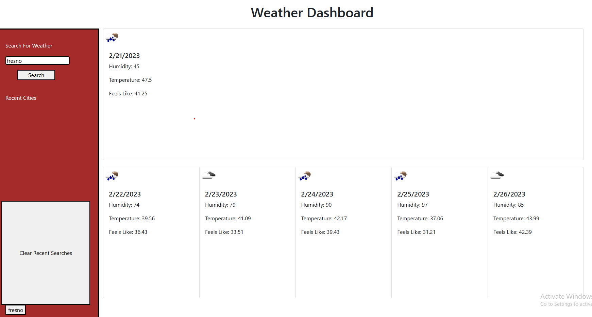

# weather-dashboard

## Application
    The way that this application works is by utilizing local storage, an openweather API, and javascript to give you weather based on the searched city. When you enter your city you will find that it gives you a five day forecast as well as logs that city on the left side to your recent searches. Please feel free to play around with searching multiple cities at a time and seeing that they will all be saved to your recent cities. There is also a clear button that will allow you to clear the local storage. 

    

